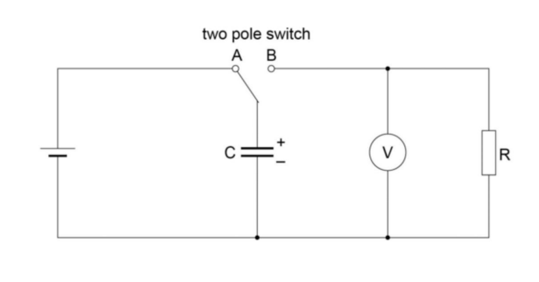

# Discharging-Capacitor
Python script that use matplotlib to create graphs of voltage against time as capacitor was discharged.
Data in values txt file is the average of two voltage values I recorded as the capacitor discharged, taken in 10 second intervals.

https://pmt.physicsandmathstutor.com/download/Physics/A-level/Notes/AQA/Practical-Skills/RP%2009%20-%20Charging%20and%20Discharging%20Capacitors.pdf
 \
*Circuit setup diagram*

Circuit set up as in diagram

Resistor used: 47kΩ \
Capacitor used: 2200µF \
Battery used: 6v
